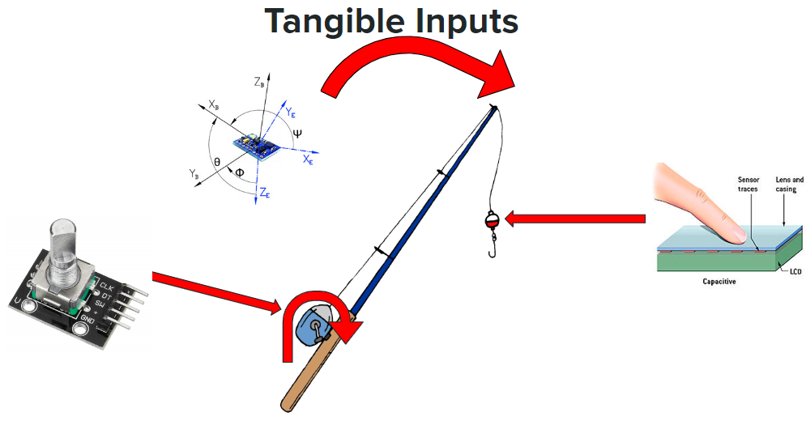
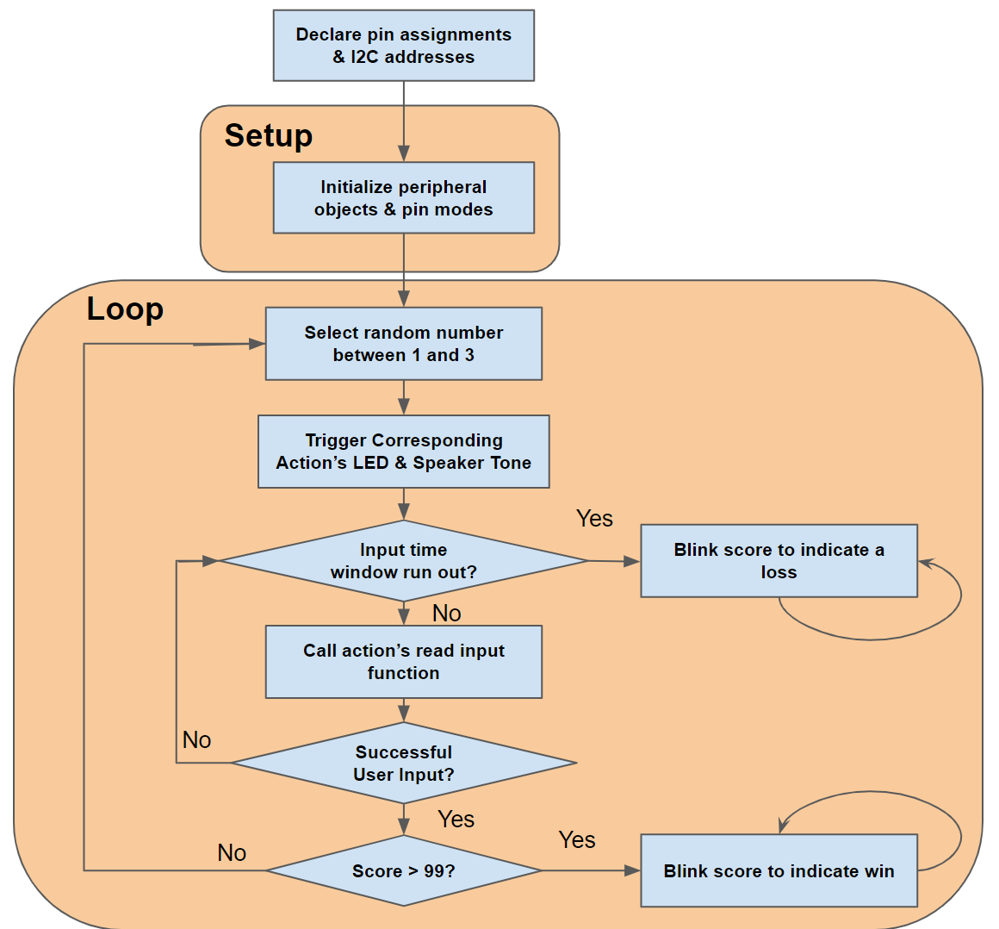
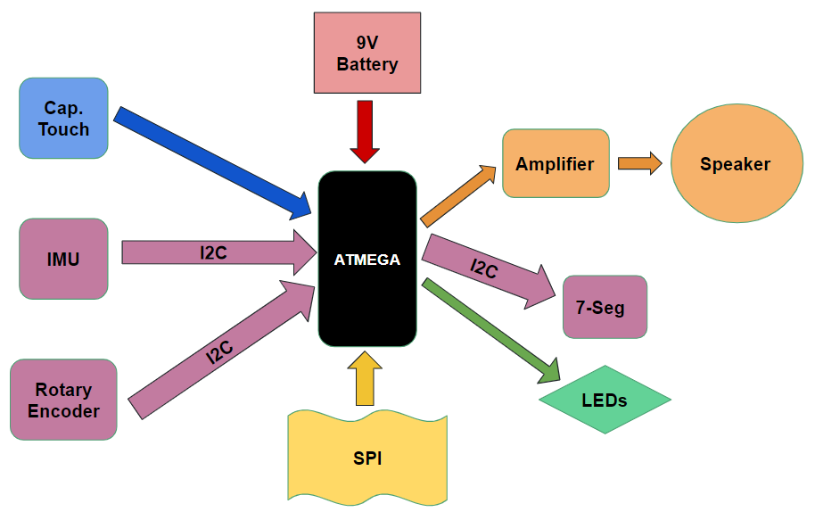
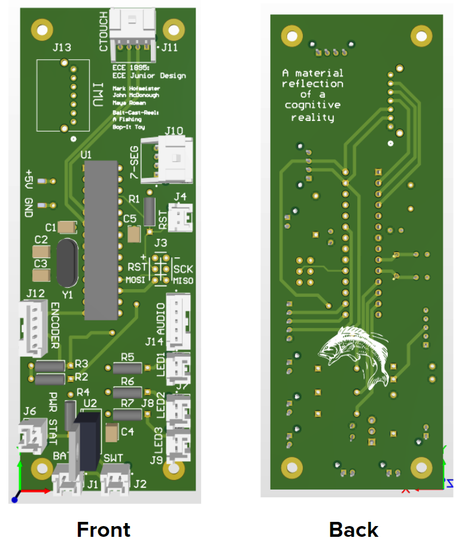
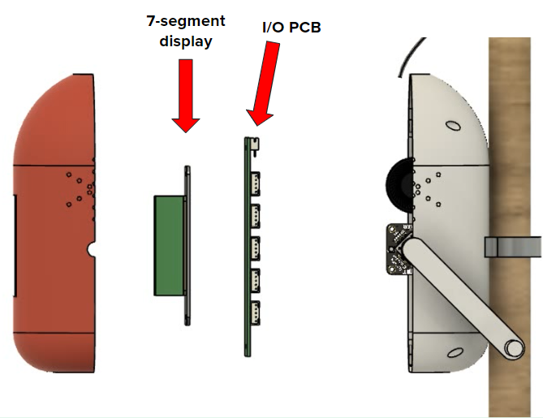
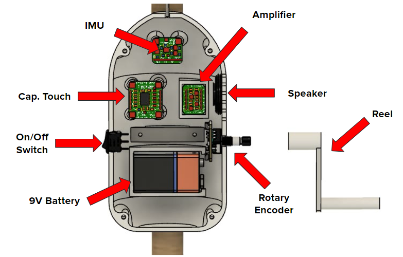

# Bait-Cast-Reel

### A fishing-inspired spinoff of the original "Bop-It" Toy, completed for the University of Pittsburgh's ECE1895: Junior Design Course. 

File Structure: 
- `Bait-Cast-Reel-PCB` - Altium schematics and pcb desdign files for a 4-layered PCB
- `Bait-Cast-Reel-PCB-2l` - Altium schematics and pcb desdign files for a 2-layered PCB
- `diagrams-datasheets` - reference datasheets and pinout diagrams
- `fab` - .stl files of things to print/laser cut and PCB .step model
- `media` - images of the design process
- `software` - main src and supplementary testing sketches

The toy is shaped like a fishing rod and randomly selects one of three user inputs, which the user must complete within the allocated time window, else the user will lose the game. The three tangible user inputs - "Bait," "Cast," and "Reel," - use 3 different transducers to determine whether or not the user input was successful. 

## Firmware Flow

## System Diagram 

## PCB

## Enclosure 

